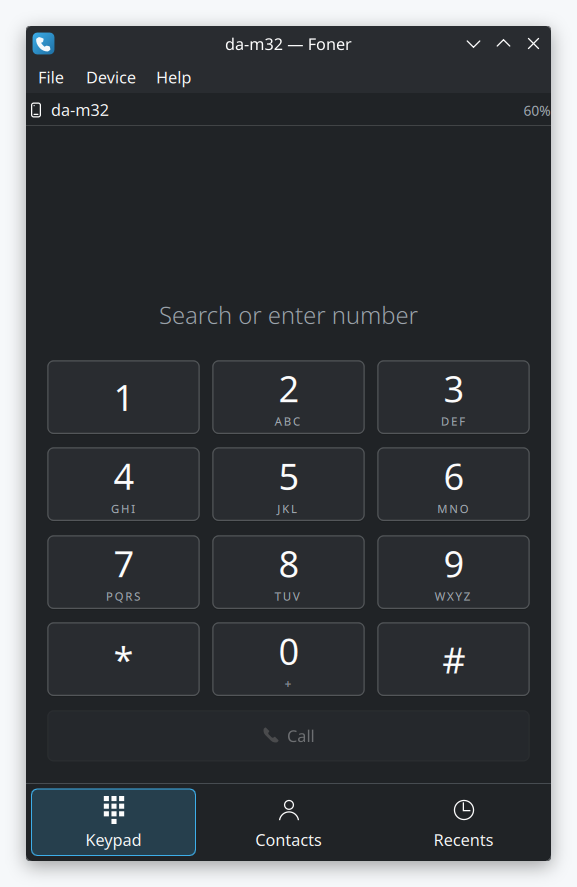
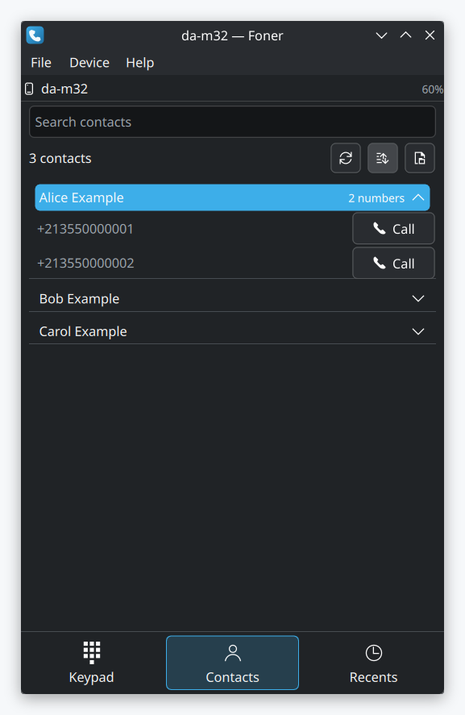
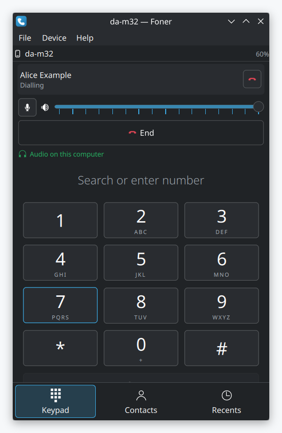

<p align="center">
  
</p>

<h1 align="center">Foner</h1>

<p align="center">
  Make and receive phone calls on your KDE desktop, through a phone paired over Bluetooth.
</p>

<p align="center">
  <a href="https://github.com/AminBlg/foner/actions/workflows/build.yml"></a>
  <a href="https://github.com/AminBlg/foner/releases/latest"></a>
  <a href="LICENSE"></a>
</p>

<p align="center">
<picture>
  <source media="(prefers-color-scheme: dark)" srcset="docs/screenshots/keypad-dark.png">
  
</picture>
<picture>
  <source media="(prefers-color-scheme: dark)" srcset="docs/screenshots/contacts-dark.png">
  
</picture>
<picture>
  <source media="(prefers-color-scheme: dark)" srcset="docs/screenshots/in-call-dark.png">
  
</picture>
</p>

Foner is a dialler for KDE Plasma. It sends commands to your phone over the Bluetooth hands-free profile (HFP). The call audio comes through this computer. The call itself stays on the phone and the mobile network. Foner has no account, no cloud service and no telemetry.

Foner 0.1.0 is the first release. It was tested with one Android phone and one iPhone, on Arch Linux with Plasma. No other desktop is tested yet.

## Requirements

- PipeWire 1.4 or newer, with its telephony module.
- BlueZ.
- A phone that is paired and connected over HFP.

If one of these is missing, Foner starts and reports that no phone is connected.

## Install

Run this command as a normal user. The script installs the dependencies, builds Foner, runs the tests, and installs to `/usr/local`. It asks for sudo only for the package install and the final copy.

```sh
curl -fsSL https://raw.githubusercontent.com/AminBlg/foner/main/scripts/install.sh | sh
```

To install into `~/.local` instead, set `FONER_PREFIX`:

```sh
curl -fsSL https://raw.githubusercontent.com/AminBlg/foner/main/scripts/install.sh | FONER_PREFIX=~/.local sh
```

The script knows the package names for Arch, Debian, Ubuntu, Fedora, openSUSE and their derivatives. On another distribution, it stops and prints the dependency list. Install those dependencies yourself, then run the script again with `FONER_SKIP_PACKAGES=1`.

| Distribution | Status |
|---|---|
| Arch Linux, CachyOS, EndeavourOS, Manjaro | Works |
| Fedora 42 and newer | Works |
| Ubuntu and Kubuntu 25.10 and newer | Works |
| Debian 13 | Works |
| openSUSE Tumbleweed, Leap 16.0 | Works |
| Ubuntu and Kubuntu 25.04 | Builds, but PipeWire 1.2 has no telephony module, so no calls |
| KDE neon | Builds, but PipeWire from the Ubuntu 24.04 base has no telephony module, so no calls |
| Ubuntu 24.04, Debian 12, RHEL 9, openSUSE Leap 15.6 | No KDE Frameworks 6, so no build |

Only Arch Linux with Plasma ran against a real phone. The other rows come from the package versions that each distribution ships.

## Build from source

Foner needs Qt 6.5 and KDE Frameworks 6.8. `scripts/install.sh` lists the package names for each distribution. Install them, then run:

```sh
cmake -S . -B build -DCMAKE_BUILD_TYPE=Release
cmake --build build -j
ctest --test-dir build --output-on-failure
sudo cmake --install build
```

## Usage

Run `foner`, then connect your phone. When the phone connects, Foner reads the phonebook and the call history.

To try the contact list with no phone, open `docs/demo-contacts.vcf` with File > Import vCard. It holds invented contacts.

## Features

- Dial, answer and end calls. Answer from a desktop notification.
- Hold one call and answer another. Swap between two calls, or join them.
- Mute the microphone, set the speaker level, and send keypad tones.
- Pull the call audio onto this computer.
- Read the contacts and the call history from the phone, and keep them on disk.
- Search contacts by name, by number, or by keypad letters: `254` finds "Ali".
- Import and export vCard files.
- Close the window, and Foner keeps running in the system tray.
- Open `tel:` links from other applications.

Two calls at once, service codes and vCard export are built, but nobody tested them against a phone yet. [docs/STATUS.md](docs/STATUS.md) lists what works and the known limits.

## Documentation

- [docs/STATUS.md](docs/STATUS.md): what works, what does not, and why.
- [docs/M0-selfio-notes.md](docs/M0-selfio-notes.md): how the PipeWire telephony interface behaves with a live phone.
- [CONTRIBUTING.md](CONTRIBUTING.md): the build, the tests and the checks for a pull request.

## Star history

<a href="https://star-history.com/#AminBlg/foner&Date">
  <picture>
    <source media="(prefers-color-scheme: dark)" srcset="https://api.star-history.com/svg?repos=AminBlg/foner&type=Date&theme=dark">
    
  </picture>
</a>

## Repo activity


## License

GPL-3.0-or-later. See [LICENSE](LICENSE).
